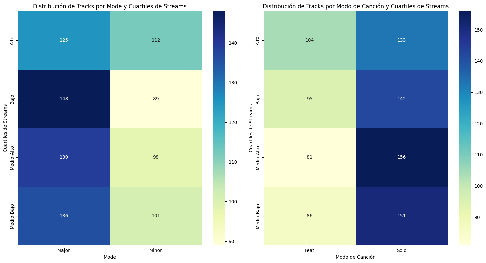

# Proyecto 2 de Análisis de Datos (Hipótesis)


  # Índice

  - [Objetivos](#objetivos)
  - [Equipo](#equipo)
  - [Herramientas y Tecnologías](#herramientas-y-tecnologas)
  - [Procesamiento y análisis](#procesamiento-y-anlisis)
    - [Creación de nuevas variables](#creacin-de-nuevas-variables)
    - [Unificación de tablas](#unificacin-de-tablas)
  - [Resultados y Conclusiones](#resultados-y-conclusiones)
    - [1. Las canciones con un mayor BPM (Beats Por Minuto) tienen más éxito en términos de cantidad de streams en Spotify.](#1-las-canciones-con-un-mayor-bpm-beats-por-minuto-tienen-ms-xito-en-trminos-de-cantidad-de-streams-en-spotify)
    - [2. Las canciones más populares en el ranking de Spotify también tienen un comportamiento similar en otras plataformas como Deezer.](#2-las-canciones-ms-populares-en-el-ranking-de-spotify-tambin-tienen-un-comportamiento-similar-en-otras-plataformas-como-deezer)
      - [Análisis de Charts (Deezer y Apple vs Spotify Charts):](#anlisis-de-charts-deezer-y-apple-vs-spotify-charts)
      - [Test t de Student para Deezer vs Spotify Charts:](#test-t-de-student-para-deezer-vs-spotify-charts)
      - [Test t de Student para Apple vs Spotify Charts:](#test-t-de-student-para-apple-vs-spotify-charts)
      - [Test de Wilcoxon-Mann-Whitney para Deezer vs Spotify Charts:](#test-de-wilcoxonmannwhitney-para-deezer-vs-spotify-charts)
      - [Test de Wilcoxon-Mann-Whitney para Apple vs Spotify Charts:](#test-de-wilcoxonmannwhitney-para-apple-vs-spotify-charts)
    - [3. La presencia de una canción en un mayor número de playlists se relaciona con un mayor número de streams.](#3-la-presencia-de-una-cancin-en-un-mayor-nmero-de-playlists-se-relaciona-con-un-mayor-nmero-de-streams)
      - [Prueba de Shapiro-Wilk para participacion_total:](#prueba-de-shapirowilk-para-participaciontotal)
      - [Test t de Student para participacion_total vs streams:](#test-t-de-student-para-participaciontotal-vs-streams)
      - [Test de Wilcoxon-Mann-Whitney para participacion_total vs streams:](#test-de-wilcoxonmannwhitney-para-participaciontotal-vs-streams)
      - [Para in_apple_playlists vs streams:](#para-inappleplaylists-vs-streams)
      - [Prueba de Shapiro-Wilk para in_apple_playlists:](#prueba-de-shapirowilk-para-inappleplaylists)
      - [Test t de Student para in_apple_playlists vs streams:](#test-t-de-student-para-inappleplaylists-vs-streams)
      - [Test de Wilcoxon-Mann-Whitney para in_apple_playlists vs streams:](#test-de-wilcoxonmannwhitney-para-inappleplaylists-vs-streams)
      - [Para in_deezer_playlists vs streams:](#para-indeezerplaylists-vs-streams)
      - [Prueba de Shapiro-Wilk para in_deezer_playlists:](#prueba-de-shapirowilk-para-indeezerplaylists)
      - [Test t de Student para in_deezer_playlists vs streams:](#test-t-de-student-para-indeezerplaylists-vs-streams)
      - [Test de Wilcoxon-Mann-Whitney para in_deezer_playlists vs streams:](#test-de-wilcoxonmannwhitney-para-indeezerplaylists-vs-streams)
    - [4. Los artistas con un mayor número de canciones en Spotify tienen más streams.](#4-los-artistas-con-un-mayor-nmero-de-canciones-en-spotify-tienen-ms-streams)
    - [5. Las características de la música influyen en el éxito en términos de cantidad de streams en Spotify.](#5-las-caractersticas-de-la-msica-influyen-en-el-xito-en-trminos-de-cantidad-de-streams-en-spotify)
    - [6. El modo de la canción, "Minor" o "Major" podría influir en la cantidad de reproducciones.](#6-el-modo-de-la-cancin-minor-o-major-podra-influir-en-la-cantidad-de-reproducciones)
    - [7. La cantidad de artista en la canción, "Solo" o "Feat" podría influir en la cantidad de reproducciones.](#7-la-cantidad-de-artista-en-la-cancin-solo-o-feat-podra-influir-en-la-cantidad-de-reproducciones)
    - [1ra Hipótesis](#1ra-hiptesis)
    - [2da Hipótesis](#2da-hiptesis)
    - [3ra Hipótesis](#3ra-hiptesis)
    - [4ta Hipótesis](#4ta-hiptesis)
    - [5ta Hipótesis](#5ta-hiptesis)
      - [Interpretación General:](#interpretacin-general)
    - [Otras Hipótesis](#otras-hiptesis)
  - [Limitaciones/Próximos Pasos:](#limitacionesprximos-pasos)
    - [Limitaciones](#limitaciones)
    - [Próximos pasos](#prximos-pasos)
  - [Enlaces de interés:](#enlaces-de-inters)


## Objetivos

Preparar la información de la base de datos que corresponde a los datos de las reproducciones de canciones más escuchadas en el año 2023 en la plataforma Spotify, Deezer y Apple, para comprender, respaldar y conocer el comportamiento que hace que una canción sea mayor o menormente escuchada en una plataforma. 
Analizar los datos, para convertirlos en información respaldada por cálculos estadísticos.

Se pretende obtener las respuestas para validar o refutar las siguientes hipótesis:

* Las canciones con un mayor BPM (Beats Por Minuto) tienen más éxito en términos de cantidad de streams en Spotify.
* Las canciones más populares en el ranking de Spotify también tienen un comportamiento similar en otras plataformas como Deezer.
* La presencia de una canción en un mayor número de playlists se relaciona con un mayor número de streams.
* Los artistas con un mayor número de canciones en Spotify tienen más streams.
* Las características de la música influyen en el éxito en términos de cantidad de streams en Spotify.
* Las el modo de la canción "Minor" o "Major" influye en la cantidad de reproducciones de la misma.

## Equipo

Osiris Berbesia - Julieta Salto

## Herramientas y Tecnologías

* SQL
* BigQuery
* Documentación de Google Console
* Documentación Python
* OpenAI - ChatGPT
* Google Slides
* YouTube

## Procesamiento y análisis

Antes de la exploración de datos, se importan los documentos contenedores de la información dentro de un proyecto en BigQuery.

Luego se procede a la limpieza de datos, la cual incluye:

* Eliminación de duplicados. (Validación que incluye que la combinación de un artista+canción esté repetida)
* Valores Nulos, permanecen en el sistema. (No afectan nuestros datos)
* Eliminación  de caracteres especiales como: �����
* Eliminación de datos donde no corresponden, ejm, caracteres de letras en variables numéricas.

Consultas utilizadas para la limpieza de datos.

Validación de duplicados que tenían artist(s)+nombre de canción repetido:
```sql
  SELECT track_name, artist_s_name
  FROM `laboratoria2.datos_hipotesis.track_in_spotify`
  GROUP BY track_name, artist_s_name
  HAVING COUNT(*) > 1
  order by track_name
```
Luego se traen todos los datos, para validar si los duplicados deben ser eliminados o realmente tomados en cuenta.

```sql
SELECT 
  t.track_id,
  t.track_name,
  t.artist_s_name,
  CAST(CONCAT(t.released_year, '-', t.released_month, '-', t.released_day) AS DATE) AS Fecha_Released,
  t.streams,
  t.in_spotify_playlists,
  tt.in_apple_playlists,
  tt.in_deezer_playlists,
  ti.bpm,
  ti.key,
  ti.mode,
  ti.`danceability_%`,
  ti.`valence_%`,
  ti.`energy_%`,
  ti.`acousticness_%`,
  ti.`instrumentalness_%`,
  ti.`liveness_%`,
  ti.`speechiness_%`
FROM 
  `laboratoria2.datos_hipotesis.track_in_spotify` t
JOIN 
  duplicates d
ON 
  t.track_name = d.track_name AND t.artist_s_name = d.artist_s_name
JOIN 
  `laboratoria2.datos_hipotesis.track_technical_info` ti
ON 
  t.track_id = ti.track_id
JOIN 
`laboratoria2.datos_hipotesis.track_in_competition` tt
ON
tt.track_id = t.track_id;
```

Con lo anterior, se determina que:

* Los dos Track id que no se tomarán en cuenta son:
    * "5080031" 
    * "7173596"

Para la validación y limpieza de carácteres de datos, junto a la omisión de los track_id que no serán utilizados, además de ser la consulta para crear el view con el que se iba a trabajar, se usó la siguiente consulta:

```sql
SELECT 
  s.track_id, 
  

  REGEXP_REPLACE(s.track_name, r"[^a-zA-Z0-9\s\-:,?\'()&]", '') as track_name,

  REGEXP_REPLACE(s.artist_s_name, r"[^a-zA-Z0-9\s\-:,?\'()&]", '') as artist_s_name,
  
  s.artist_count, 
 CAST(CONCAT(s.released_year, '-', s.released_month, '-', s.released_day) AS DATE) AS released_date,
   s.in_spotify_playlists, s.in_spotify_charts,
  c.in_apple_playlists, 
  c.in_apple_charts,
  c.in_deezer_playlists,
   c.in_deezer_charts, 
   c.in_shazam_charts,
  (s.in_spotify_playlists+c.in_apple_playlists+c.in_deezer_playlists) as participacion_total, s.streams

FROM `laboratoria2.datos_hipotesis.track_in_spotify` AS s
INNER JOIN
(SELECT track_id, in_apple_playlists,in_apple_charts, in_deezer_playlists,in_deezer_charts, in_shazam_charts FROM `laboratoria2.datos_hipotesis.track_in_competition`) AS c
ON s.track_id = c.track_id
where
s.track_id != "5080031" and s.streams NOT LIKE "%B%" and s.track_id !="7173596";
```

### Creación de nuevas variables

 * categoria_artista: separa a las superestrellas, estrellas y artistas de nicho, basandose en el recorrido artístico de cada artista.


 * genero_artista: asigna a aproximadamente las 100 canciones con más éxito el genero a la que corresponde el artista, dentro de las cuales están:
    * Rock
    * Pop
    * Otros
    * Hip-Hop/Rap
    * R&B
    * Electrónica
    * Reggaeton
    * Regional Mexicano


 * modo_cancion: tomando en cuenta la variable existente artist_count (cantidad de artistas que participan en la canción) se categoriza la canción según su participación, como:
    * Feat (participa más de un artista)
    * Solo (Participa solo un artista)

 * released_date: es el resultado del concatenado de la fecha separada por día, mes y año de la tabla original en formato DATE.


 * participacion_total: es la sumatoria de las playlist en la que aparece una canción en las tres plataformas

* cuartiles:

  Los siguientes cuartiles categorizan entre alto y bajo segun el valor de la caracteristica de la música:

  * cuartiles_dance
  * cuartiles_valence
  * cuartiles_energy
  * cuartiles_acousticness
  * cuartiles_intrumental
  * cuartiles_live
  * cuartiles_speech

Los siguientes dividen en 4 variables a los cuartiles según el valor de la cantidad de streams de cada valor. Donde:

  * cuartiles_streams: variable numérica del 1 al 4


  * cuartiles_categoria: variable string que categoriza la variable anterior en:
    * 4 - Alto
    * 3 - Medio-Alto
    * 2 - Medio-Bajo
    * 1 - Bajo


### Unificación de tablas
Se genera un view, donde está el unificado de nuestras primeras 3 tablas proporcionadas, más las nuevas variables. 

La tabla unificada queda así:


## Resultados y Conclusiones
---
Resultados
---

Después de la limpieza de los datos, de 953 tracks, quedaron 948 tracks.

Con los cuales se puede concluir lo siguiente para cada hipótesis:

### 1. Las canciones con un mayor BPM (Beats Por Minuto) tienen más éxito en términos de cantidad de streams en Spotify.

Se exploró la relación entre una variable y otra a través de la correlación de Pearson, la cual dió el siguiente resultado:
-0.0007 Lo cual, al ser un resultado más cercano a 0 que a 1 o -1, indica que no hay ninguna correlación entre estas variables.

Observando gráficamente, a través de un scatter plot:


Se observa igualmente que los datos están dispersos y no se puede demostrar que esten relacionados entre si.

Por otro lado, aunque en este mapa de calor, se puede ver de forma gráfica que los que tienen BPM Bajos (por debajo de 130), tienen un conteo mayor de tracks


### 2. Las canciones más populares en el ranking de Spotify también tienen un comportamiento similar en otras plataformas como Deezer.

Las plataformas que se evaluaron fueron Deezer y Apple. 

Obteniendo los siguientes resultados de la siguiente Query:

```sql
 SELECT CORR(b.in_deezer_charts,a.in_spotify_charts) as correlacion_spo_deezer,CORR(b.in_apple_charts,a.in_spotify_charts) as correlacion_spo_apple FROM `laboratoria2.datos_hipotesis.track_in_spotify`  a

 JOIN 

 `laboratoria2.datos_hipotesis.track_in_competition` b

 ON 

 a.track_id = b.track_id
 ```
 


Gráficamente la relación entre las plataformas es la siguiente:


Aplicando igualmente otras pruebas y test estadísticos, se obtienen los siguientes resultados:

#### Análisis de Charts (Deezer y Apple vs Spotify Charts):
Prueba de Shapiro-Wilk para Spotify Charts:
W-statistic: 0.6869614720344543
p-value: 1.6415153248964974e-37
Indica que los datos de Spotify Charts no siguen una distribución normal, ya que el p-value es extremadamente pequeño.

#### Test t de Student para Deezer vs Spotify Charts:

T-statistic: -14.264810631405497
p-value: 2.486799167406407e-42
Hay evidencia significativa para rechazar la hipótesis nula de que no hay diferencia entre las medias de Deezer y Spotify Charts. La popularidad en Deezer es significativamente diferente a la de Spotify.

#### Test t de Student para Apple vs Spotify Charts:
T-statistic: 23.435564295372654
p-value: 1.1223952978245818e-99
Hay evidencia significativa para rechazar la hipótesis nula de que no hay diferencia entre las medias de Apple y Spotify Charts. La popularidad en Apple Charts es significativamente diferente a la de Spotify.

#### Test de Wilcoxon-Mann-Whitney para Deezer vs Spotify Charts:

U-statistic: 263284.0
p-value: 4.150186927427789e-36
Indica que hay diferencias significativas en cómo se distribuyen las posiciones en los charts entre Deezer y Spotify.

#### Test de Wilcoxon-Mann-Whitney para Apple vs Spotify Charts:

U-statistic: 628814.0
p-value: 4.662872441105302e-110
Indica que hay diferencias significativas en cómo se distribuyen las posiciones en los charts entre Apple y Spotify.


### 3. La presencia de una canción en un mayor número de playlists se relaciona con un mayor número de streams.

Para evaluar esta hipótesis, se realizó la consulta:
```sql
SELECT
  CORR(CAST(streams AS int64), participacion_total) AS correlacion
FROM
  `laboratoria2.datos_hipotesis.participacion_playlists`
```
Donde el resultado fue:


Con las pruebas estadisticas adicionales, se obtiene que:
#### Prueba de Shapiro-Wilk para participacion_total:

* W-statistic (estadístico W): 0.605
* p-value: 6.32e-42
* Interpretación: La prueba de Shapiro-Wilk verifica si los datos siguen una distribución normal. Con un p-value extremadamente bajo, podemos rechazar la hipótesis nula de normalidad. Esto indica que participacion_total no sigue una distribución normal.

#### Test t de Student para participacion_total vs streams:

* T-statistic (estadístico t): -27.88
* p-value: 2.19e-125
* Interpretación: Este test compara las medias de participacion_total y streams. Un p-value tan bajo sugiere que hay una diferencia significativa entre estas variables. En términos simples, la cantidad de streams está muy relacionada con la participación total, con una correlación muy fuerte y negativa (es decir, más participación total significa menos streams y viceversa).

#### Test de Wilcoxon-Mann-Whitney para participacion_total vs streams:

* Error: x and y must be of nonzero size.
* Interpretación: Hubo un error porque los datos no cumplen con los requisitos para este test específico en cuanto a tamaño.

#### Para in_apple_playlists vs streams:
#### Prueba de Shapiro-Wilk para in_apple_playlists:

* W-statistic: 0.721
* p-value: 5.06e-37
* Interpretación: Similar a participacion_total, in_apple_playlists no sigue una distribución normal, debido al p-value muy bajo.

#### Test t de Student para in_apple_playlists vs streams:

* T-statistic: -27.88
* p-value: 2.19e-125
* Interpretación: Hay una correlación significativa y negativa entre in_apple_playlists y streams, lo que sugiere que las canciones que están en más playlists de Apple tienden a tener menos streams, y viceversa.

#### Test de Wilcoxon-Mann-Whitney para in_apple_playlists vs streams:

* U-statistic: 145.0
* p-value: 0.367
* Interpretación: El p-value relativamente alto indica que no hay una diferencia significativa en los valores de streams entre las canciones que están o no en playlists de Apple. En criollo, estar en playlists de Apple no parece afectar de manera considerable la cantidad de streams.

#### Para in_deezer_playlists vs streams:
#### Prueba de Shapiro-Wilk para in_deezer_playlists:

* W-statistic: 0.363
* p-value: 0.0
* Interpretación: Similar a los anteriores, in_deezer_playlists no sigue una distribución normal debido al p-value cercano a cero.

#### Test t de Student para in_deezer_playlists vs streams:

* T-statistic: -27.88
* p-value: 2.19e-125
* Interpretación: Hay una correlación significativa y negativa entre in_deezer_playlists y streams, lo que indica que las canciones en más playlists de Deezer tienden a tener menos streams, y viceversa.

#### Test de Wilcoxon-Mann-Whitney para in_deezer_playlists vs streams:

* U-statistic: 139.0
* p-value: 0.600
* Interpretación: Al igual que con Apple Music, el p-value alto sugiere que no hay una diferencia significativa en los valores de streams entre las canciones que están o no en playlists de Deezer.


### 4. Los artistas con un mayor número de canciones en Spotify tienen más streams.

Al analizar la correlación de Pearson con la siguiente query:

```sql
WITH
  auxiliar AS (
  SELECT
    artist_s_name,
    COUNT(artist_s_name) AS conteo,
    SUM(CAST(streams AS int)) AS streamss
  FROM
    `laboratoria2.datos_hipotesis.view_unificado`
  GROUP BY
    artist_s_name
  ORDER BY
    conteo DESC)
SELECT
  CORR(a.streamss, a.conteo)
FROM
  auxiliar a
  ```

  Obtenemos como resultado 0.78, que al estar más cercano a 1, indica que hay una correlación lineal positiva.

  Visualmente podemos observar el siguiente comportamiento:

  


### 5. Las características de la música influyen en el éxito en términos de cantidad de streams en Spotify.

Los resultados para la correlación de Pearson para cada una de las caracteristicas de la música, nos dicen que:


Resultados cercanos a 1 o -1:

* Ninguno

Resultados cercanos a 0:

* `danceability_%`
* `valence_%`,
* `energy_%`,
* `acousticness_%`,
* `instrumentalness_%`,
* `liveness_%`,
* `speechiness_%`

Los resultados aplicando la pruebas de Shapiro, y el test T y Wilcoxon fueron:

* Característica: danceability_%

    Shapiro-Wilk (Alto): 0.0000

    Shapiro-Wilk (Bajo): 0.0025

    Shapiro-Wilk (Medio-Alto): 0.0008

    Shapiro-Wilk (Medio-Bajo): 0.0032

    Test T (Alto vs Bajo): 0.3248

    Test T (Alto vs Medio-Alto): 0.4413

    Test T (Alto vs Medio-Bajo): 0.7481

    Test Wilcoxon (Alto vs Bajo): 0.3248

    Test Wilcoxon (Alto vs Medio-Alto): 0.4413

    Test Wilcoxon (Alto vs Medio-Bajo): 0.7481

* Característica: valence_%

    Shapiro-Wilk (Alto): 0.0004

    Shapiro-Wilk (Bajo): 0.0001

    Shapiro-Wilk (Medio-Alto): 0.0011

    Shapiro-Wilk (Medio-Bajo): 0.0004

    Test T (Alto vs Bajo): 0.2154

    Test T (Alto vs Medio-Alto): 0.4086

    Test T (Alto vs Medio-Bajo): 0.2594

    Test Wilcoxon (Alto vs Bajo): 0.2154

    Test Wilcoxon (Alto vs Medio-Alto): 0.4086

    Test Wilcoxon (Alto vs Medio-Bajo): 0.2594

* Característica: energy_%

    Shapiro-Wilk (Alto): 0.0008

    Shapiro-Wilk (Bajo): 0.0003

    Shapiro-Wilk (Medio-Alto): 0.0029

    Shapiro-Wilk (Medio-Bajo): 0.0024

    Test T (Alto vs Bajo): 0.9597

    Test T (Alto vs Medio-Alto): 0.1603

    Test T (Alto vs Medio-Bajo): 0.9361

    Test Wilcoxon (Alto vs Bajo): 0.9597

    Test Wilcoxon (Alto vs Medio-Alto): 0.1603

    Test Wilcoxon (Alto vs Medio-Bajo): 0.9361

* Característica: acousticness_%

    Shapiro-Wilk (Alto): 0.0000

    Shapiro-Wilk (Bajo): 0.0000

    Shapiro-Wilk (Medio-Alto): 0.0000

    Shapiro-Wilk (Medio-Bajo): 0.0000

    Test T (Alto vs Bajo): 0.5453

    Test T (Alto vs Medio-Alto): 0.2720

    Test T (Alto vs Medio-Bajo): 0.8491

    Test Wilcoxon (Alto vs Bajo): 0.5453

    Test Wilcoxon (Alto vs Medio-Alto): 0.2720

    Test Wilcoxon (Alto vs Medio-Bajo): 0.8491

* Característica: instrumentalness_%

    Shapiro-Wilk (Alto): 0.0000

    Shapiro-Wilk (Bajo): 0.0000

    Shapiro-Wilk (Medio-Alto): 0.0000

    Shapiro-Wilk (Medio-Bajo): 0.0000

    Test T (Alto vs Bajo): 0.1898

    Test T (Alto vs Medio-Alto): 0.5492

    Test T (Alto vs Medio-Bajo): 0.2485

    Test Wilcoxon (Alto vs Bajo): 0.1898

    Test Wilcoxon (Alto vs Medio-Alto): 0.5492

    Test Wilcoxon (Alto vs Medio-Bajo): 0.2485

* Característica: liveness_%

    Shapiro-Wilk (Alto): 0.0000

    Shapiro-Wilk (Bajo): 0.0000

    Shapiro-Wilk (Medio-Alto): 0.0000

    Shapiro-Wilk (Medio-Bajo): 0.0000

    Test T (Alto vs Bajo): 0.7573

    Test T (Alto vs Medio-Alto): 0.9912

    Test T (Alto vs Medio-Bajo): 0.5676

    Test Wilcoxon (Alto vs Bajo): 0.7573

    Test Wilcoxon (Alto vs Medio-Alto): 0.9912

    Test Wilcoxon (Alto vs Medio-Bajo): 0.5676

* Característica: speechiness_%

    Shapiro-Wilk (Alto): 0.0000

    Shapiro-Wilk (Bajo): 0.0000

    Shapiro-Wilk (Medio-Alto): 0.0000

    Shapiro-Wilk (Medio-Bajo): 0.0000

    Test T (Alto vs Bajo): 0.9972

    Test T (Alto vs Medio-Alto): 0.2983

    Test T (Alto vs Medio-Bajo): 0.0985

    Test Wilcoxon (Alto vs Bajo): 0.9972

    Test Wilcoxon (Alto vs Medio-Alto): 0.2983

    Test Wilcoxon (Alto vs Medio-Bajo): 0.0985

### 6. El modo de la canción, "Minor" o "Major" podría influir en la cantidad de reproducciones.

Se decidió analizar y explorar adicionalmente lo que sería el mode de la canción, aunque no era una hipótesis solicitada/planteada por la discográfica, se consideró pertinente hacer estudio de la misma, los estudios en cuanto a la correlación de Pearson para esta variable arrojaron los siguientes resultados gráficos


### 7. La cantidad de artista en la canción, "Solo" o "Feat" podría influir en la cantidad de reproducciones.

Se decidió analizar y explorar adicionalmente cuanto podría influir si un artista solista o un grupo podría ser positivo para la cantidad de streams, aunque no era una hipótesis solicitada/planteada por la discográfica, se consideró pertinente hacer estudio de la misma, los estudios en cuanto a la correlación de Pearson para esta variable arrojaron los siguientes resultados gráficos: 


---
Conclusiones
---

Según cada hipótesis:

### 1ra Hipótesis

No se observa que los BPM tengan una relación lineal con la cantidad de streams, ya que no existe correlación lineal para afirmar que las canciones tengan más o menos éxito en streams de Spotify.

Al evaluar los datos a través de la prueba Shapiro-Wilk, se puede asumir que los datos para BPM y Streams en todas las categorías de cuartiles siguen una distribución normal.
Por lo cual, podemos aplicar Test Mann-Whitney U como segunda comprobación de la influencia de una variable sobre la otra.
En el cual los resultados sugieren que no hay diferencias significativas en los promedios de BPM entre los cuartiles Alto y Bajo, ni entre Medio-Alto y Medio-Bajo, ya que los p-valores son altos (1.0), lo que indica que no hay suficiente evidencia para rechazar la hipótesis nula de que las distribuciones de BPM en estos grupos son iguales.
En otras palabras, los datos disponibles no muestran una diferencia significativa en los promedios de BPM entre los grupos.

Corroborandose de igual forma con la regresión lineal simple:


### 2da Hipótesis

A pesar de que se encontró una relación lineal positiva, lo que sugiere que si es popular en Spotify a su vez será popular en las otras plataformas (Deezer, Apple), los tests estadísticos muestran que Deezer y Apple tienen diferencias significativas en popularidad comparadas con Spotify Charts. Esto se evidencia en los valores bajos de p-value en los tests t de Student y los tests de Wilcoxon-Mann-Whitney. E igualmente Deezer y Apple tienen patrones de popularidad diferentes a los de Spotify, según los análisis de charts realizados.

### 3ra Hipótesis 
Tomando en cuenta el resultado de la correlaciónde Pearson en las variables estudiadas, luego de aplicar las pruebas estadíticas adicionales tenemos que:

Para participacion_total: Las canciones con más participación total tienden a tener menos streams, y viceversa. Esto sugiere que la popularidad total de una canción no siempre se traduce en más streams.

Para in_apple_playlists y in_deezer_playlists: Estar en playlists de Apple o Deezer no parece influir significativamente en la cantidad de streams que una canción recibe. Parece que otros factores podrían ser más determinantes en este sentido.

### 4ta Hipótesis

Se encontró una relación lineal positiva, que sugiere que mientras más canciones tenga un artista o grupo, mayor será la sumatoria de sus streams, sin embargo, los artistas más populares a nivel mundial tienen mayor cantidad de streams sin un gran número de canciones

### 5ta Hipótesis

En cuanto al análisis relacionado con la correlación de Pearson, nos muestra que en cada caracteristica se encontró que: mientras más bailable y más palabras haya en la canción tienen una relación lineal negativa en cuanto al éxito en términos de streams, mientras que a diferencia de las caracteristicas valence, energy, acusticness, instrumentality y liveness, estás no tienen correlación lineal ni positiva ni negativa.

Sin embargo, tomando en consideración las pruebas y los test de significancia, se obtiene que:

* Danceability (%)

  * Shapiro-Wilk: Todos los grupos (Alto, Bajo, Medio-Alto, Medio-Bajo) muestran valores de p muy pequeños (todos < 0.01), lo que indica que la distribución de la danceability no sigue una distribución normal en ninguno de los grupos.
  * Test T de Welch y Test de Wilcoxon: Para todas las comparaciones (Alto vs Bajo, Alto vs Medio-Alto, Alto vs Medio-Bajo), los valores de p son mayores que 0.05, lo cual sugiere que no hay diferencias significativas en la danceability entre estos grupos.

* Valence (%)

  * Shapiro-Wilk: Similar a danceability, todos los grupos muestran valores de p muy pequeños, indicando que la distribución del valence no es normal en ninguno de los grupos.
  * Test T de Welch y Test de Wilcoxon:Los valores de p para todas las comparaciones son mayores que 0.05, lo que sugiere que no hay diferencias significativas en el valence entre los grupos.

* Energy (%)

  * Shapiro-Wilk:Todos los grupos muestran valores de p muy pequeños, lo que indica que la distribución de la energy no es normal en ninguno de los grupos.
  * Test T de Welch y Test de Wilcoxon:Los valores de p para las comparaciones Alto vs Bajo y Alto vs Medio-Bajo son mayores que 0.05, indicando que no hay diferencias significativas en la energy entre estos grupos. Sin embargo, para Alto vs Medio-Alto, el valor de p es menor que 0.05, sugiriendo que podría haber diferencias significativas en energy entre estos grupos.

* Acousticness (%), Instrumentalness (%), Liveness (%), Speechiness (%)

  * Shapiro-Wilk:Para todas estas características, todos los grupos muestran valores de p muy pequeños, indicando que ninguna de estas características sigue una distribución normal en ninguno de los grupos.
  * Test T de Welch y Test de Wilcoxon:En general, los valores de p para estas características y las comparaciones realizadas (Alto vs Bajo, Alto vs Medio-Alto, Alto vs Medio-Bajo) son mayores que 0.05, lo que sugiere que no hay diferencias significativas en estas características entre los grupos.

#### Interpretación General:

En la mayoría de las características analizadas (danceability, valence, acousticness, instrumentalness, liveness, speechiness), no se encontraron diferencias significativas entre los grupos de cuartiles (Alto, Bajo, Medio-Alto, Medio-Bajo) según los tests estadísticos realizados.

En energy, se observó una diferencia significativa entre el grupo Alto y Medio-Alto, lo que podría indicar una diferencia en los niveles de energy entre estos grupos.

Estos resultados refuerzan la conclusión de que las características musicales analizadas no muestran variaciones significativas entre los diferentes niveles de streams representados por los cuartiles de categoría.

### Otras Hipótesis

Podemos concluir observando los siguientes gráficos:




Que el modo Major combinado con la modalidad Solo tiene una ventaja significativa en comparación a Feat con Minor.

Por todas las conclusiones anteriores, podemos identificar qué lo que hace que una canción sea exitosa es:

* El año de lanzamiento
* Cantidad de canciones del artista
* El modo de la canción 
* Las plataformas donde aparece
* Modo de canción

Y las recomendaciones para la discográfica son:

* Que el artista sea solista 
* La canción sea en modo Major
* Sacar la canción en todas las plataformas
* Recomendado de canciones promedio a lanzar: 3


## Limitaciones/Próximos Pasos:

### Limitaciones

* La variable charts en las plataformas, no era clara
* No se obtuvo de forma precisa el género asignado a cada canción para sacar mejores conclusiones
* No se tiene el género del artista que se va a lanzar, para hacer una segmentación más adecuada de los datos
* Hay una cantidad de eventos/situaciones que hace que una canción tenga comportamientos atípicos:
  * Se hizo viral
  * Se usó en una película que llegó a ser famosa
  * Fue un hit sorpresa
  * Se parecía intencional/no intencionalmente a otra canción existente y se generaron noticias alrededor de esta que la popularizaron

Por todo lo anterior, las recomendaciones son una declaración basada en el estudio de los datos que no pretende preveer comportamientos atípicos a futuro.


### Próximos pasos

* Monitorear tendencias emergentes: Continuar monitoreando nuevas tendencias en la industria musical que puedan impactar el comportamiento de las canciones en las plataformas de streaming.

* Refinar la segmentación por características emergentes: Obtener y utilizar datos actualizados sobre características emergentes de las canciones, como la popularidad en listas de reproducción específicas o tendencias virales recientes.

* Explorar colaboraciones y remixes: Investigar cómo las colaboraciones entre artistas y los remixes afectan el rendimiento de las canciones en diferentes plataformas.

* Mejorar la precisión en la asignación de géneros: Desarrollar métodos más precisos para asignar géneros musicales tanto a canciones como a artistas, utilizando técnicas avanzadas de procesamiento de texto y análisis de contenido.

* Evaluar el impacto de campañas de marketing y promoción: Analizar cómo diferentes estrategias de marketing y promoción influencian la popularidad y el rendimiento de las canciones en las plataformas de streaming.


## Enlaces de interés:

* [Google Colab Notebook](https://colab.research.google.com/drive/1WFhzvPDD8SYc2n5df5IysLFr5h8cMPmx?usp=sharing)

* [Presentación - Google Slides](https://docs.google.com/presentation/d/1X3Xdv1IGNor8D9KBSDh25LyeDOJMR0BY027JqDykrEs/edit?usp=sharing)

* [Video Loom]

* [Repertorio GitHub](https://github.com/osirisberbesia/Laboratoria-Proyecto2-Hipotesis)


